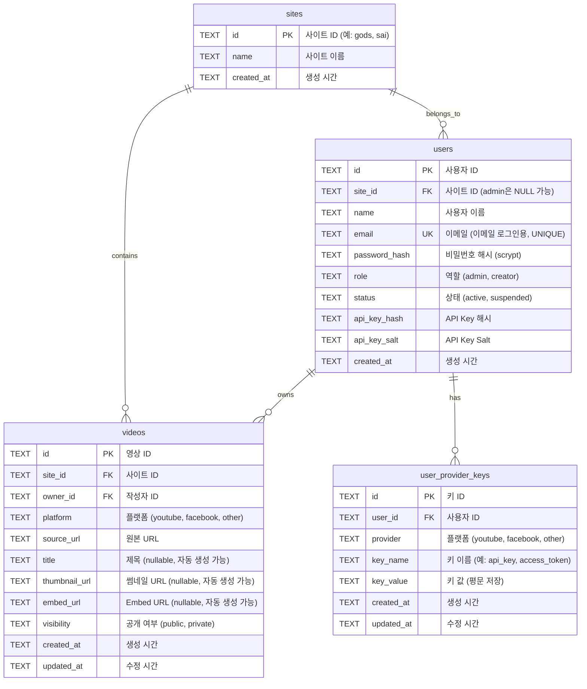

# 🗂️ CMS API Database ERD

## Entity Relationship Diagram



---

## 테이블 관계 설명

### 1. sites ↔ users (1:N)
- **관계**: 한 사이트는 여러 Creator를 가질 수 있음
- **FK**: `users.site_id` → `sites.id`
- **특징**: Admin은 `site_id`가 NULL (전체 사이트 관리)

### 2. sites ↔ videos (1:N)
- **관계**: 한 사이트는 여러 영상을 가질 수 있음
- **FK**: `videos.site_id` → `sites.id`
- **CASCADE**: 사이트 삭제 시 영상도 삭제

### 3. users ↔ videos (1:N)
- **관계**: 한 사용자는 여러 영상을 소유할 수 있음
- **FK**: `videos.owner_id` → `users.id`
- **특징**: Creator는 자기 영상만 CRUD 가능

### 4. users ↔ user_provider_keys (1:N)
- **관계**: 한 사용자는 여러 플랫폼 키를 가질 수 있음
- **FK**: `user_provider_keys.user_id` → `users.id`
- **CASCADE**: 사용자 삭제 시 키도 삭제
- **UNIQUE**: (user_id, provider, key_name) 조합은 고유

---

## 인덱스

성능 최적화를 위한 인덱스:

- `idx_videos_site_id`: 사이트별 영상 조회
- `idx_videos_owner_id`: 작성자별 영상 조회
- `idx_videos_visibility`: 공개/비공개 필터링
- `idx_users_site_id`: 사이트별 사용자 조회
- `idx_user_provider_keys_user_id`: 사용자별 키 조회

---

## 제약 조건 (CHECK)

### users 테이블
- `role IN ('admin', 'creator')`
- `status IN ('active', 'suspended')`

### videos 테이블
- `platform IN ('youtube', 'facebook', 'other')`
- `visibility IN ('public', 'private')`

### user_provider_keys 테이블
- `provider IN ('youtube', 'facebook', 'other')`

---

## 데이터 흐름

### Creator 생성 흐름
```
Admin
  ↓ POST /admin/creators
  ↓ {site_id, name, email, password}
  ↓
sites 테이블에서 site_id 확인
  ↓
users 테이블에 INSERT
  ├── api_key_hash (scrypt)
  ├── password_hash (scrypt, 선택)
  └── email (선택)
```

### 영상 등록 흐름
```
Creator (JWT 또는 API Key)
  ↓ POST /videos
  ↓ {platform, source_url, ...}
  ↓
메타정보 자동 생성 (metadata.js)
  ├── YouTube: title, thumbnail, embed
  └── Facebook: embed만
  ↓
videos 테이블에 INSERT
  ├── site_id: Creator의 site_id로 강제
  └── owner_id: Creator의 id로 강제
```

### 공개 API 조회 흐름
```
외부 홈페이지 (인증 불필요)
  ↓ GET /public/videos?site_id=gods
  ↓
videos 테이블 쿼리
  ├── WHERE site_id = 'gods'
  ├── AND visibility = 'public'
  └── LEFT JOIN users (owner_name)
  ↓
JSON 응답 (메타정보 포함)
```

---

## 보안 설계

### 인증 정보 저장
- **API Key**: scrypt 해싱 (salt 포함)
- **비밀번호**: scrypt 해싱 (salt 포함)
- **JWT 토큰**: 서버에서 검증 (비저장)

### 권한 분리
- **Admin**: 모든 site_id 접근 가능
- **Creator**: 자기 site_id만 접근 가능
- **Public API**: visibility='public'만 조회

### 데이터 격리
- site_id 기반 멀티테넌트
- Creator는 자기 owner_id 데이터만 CRUD
- CASCADE DELETE로 데이터 정합성 유지

---

## 확장 가능성

### 추가 가능한 테이블

1. **sessions** (세션 관리)
   - JWT 블랙리스트
   - 로그인 이력

2. **audit_logs** (감사 로그)
   - 모든 CRUD 작업 기록
   - 누가, 언제, 무엇을

3. **comments** (댓글)
   - 영상에 댓글 기능

4. **categories** (카테고리)
   - 영상 분류

5. **tags** (태그)
   - 영상 태그 (N:M 관계)

---

## 마이그레이션 이력

### v1.0 (초기)
- sites, users, videos, user_provider_keys

### v2.0 (현재)
- users에 email, password_hash 추가
- JWT 인증 지원
- 하이브리드 인증 시스템

---

## 데이터베이스 백업

### 백업 명령
```bash
# Windows
copy cms.db cms.db.backup

# Mac/Linux
cp cms.db cms.db.backup
```

### 복원 명령
```bash
# Windows
copy cms.db.backup cms.db

# Mac/Linux
cp cms.db.backup cms.db
```

---

## 참고

- **DB 파일**: `cms.db` (프로젝트 루트)
- **DB 엔진**: SQLite 3
- **라이브러리**: better-sqlite3
- **인코딩**: UTF-8
- **타임존**: UTC (datetime('now'))


